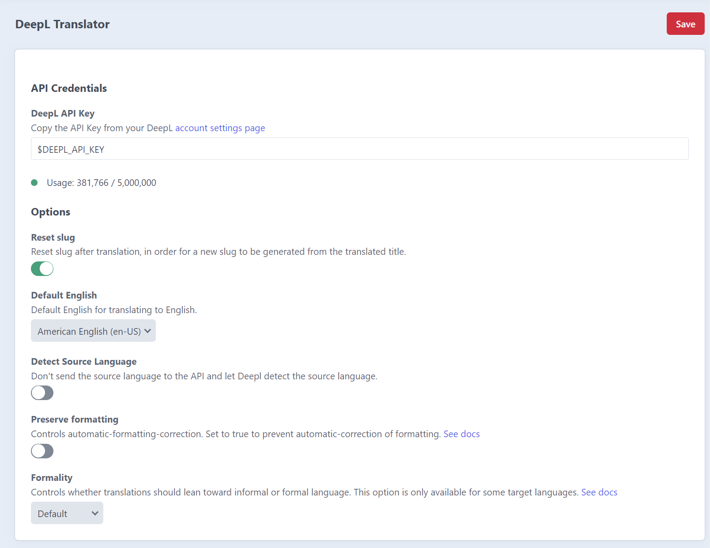
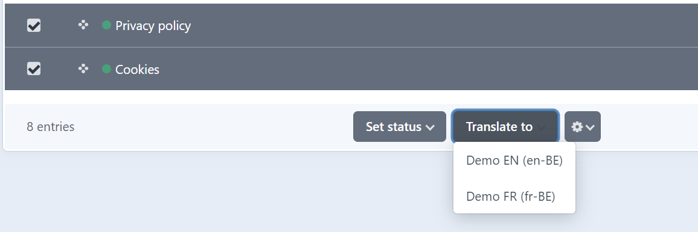
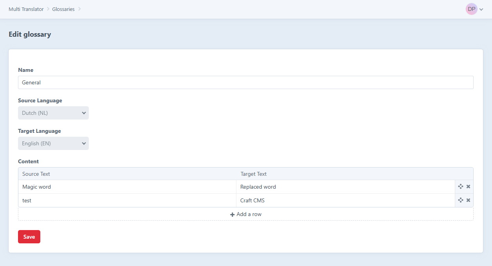

# Multi Translator

Translate content of elements using external services

## Requirements

This plugin requires Craft CMS 4.4.0 or later, and PHP 8.0.2 or later.

## Installation

You can install this plugin from the Plugin Store or with Composer.

#### From the Plugin Store

Go to the Plugin Store in your project’s Control Panel and search for “Multi Translator”. Then press “Install”.

#### With Composer

Open your terminal and run the following commands:

```bash
composer require digitalpulsebe/craft-multi-translator -w && php craft plugin/install multi-translator
```

when using DDEV:

```bash
ddev composer require digitalpulsebe/craft-multi-translator -w && ddev exec php craft plugin/install multi-translator
```

## Translation Services

For now, we support these API services:

- Deepl - Create your account at [Deepl](https://www.deepl.com/nl/pro-api) to get an API Key
  - with support for [Glossaries](#manage-glossaries)
- Google Cloud Translation - Create an API key in your [Cloud Console](https://console.cloud.google.com/)
- OpenAI (ChatGPT) - Create an API key in at [OpenAI](https://platform.openai.com/)

## Roadmap

Please let us now which API's and features are desired for this plugin!

## Plugin Settings

Configure options in the Craft control panel settings



## Permissions

For non-admin users, enable the permission 'Translate Content' under 'Multi Translator'

## Supported field types

- craft\fields\PlainText
- craft\fields\Table
- craft\redactor\Field
- craft\ckeditor\Field
- verbb\vizy\fields\VizyField
- craft\fields\Matrix (recursive)
- benf\neo\Field (recursive)
- verbb\supertable\fields\SuperTableField (recursive)
- lenz\linkfield\fields\LinkField
- nystudio107\seomatic\fields\SeoSettings
- ether\seo\fields\SeoField

## Usage

There are two ways to trigger a translation.

### Translate one-by-one

1. Navigate to the entry and the desired target site/language.
2. Use the buttons in the sidebar and select the source language.


### Translate in bulk

1. Navigate to overview of entries you want to get translated.
2. Select the entries in the source language.
3. Use the 'Translate to' dropdown in the actions bar and choose the target language
4. A queue job will be started



### Manage Glossaries

When using DeepL API, you can add a glossary for [supported language pairs](https://developers.deepl.com/docs/api-reference/glossaries).
When translating, the plugin will search a glossary for the appropriate source and target language.
There can only be **one glossary for each language pair**.


